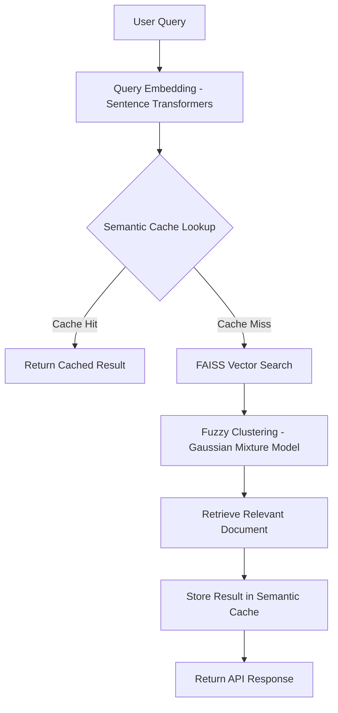

# Trademarkia AI/ML Engineer Internship Assignment

## Semantic Search System with Fuzzy Clustering and Semantic Cache

## Project Overview

This project implements a lightweight **Semantic Search System** using the **20 Newsgroups dataset**. The system combines **vector embeddings, fuzzy clustering, semantic caching, and a FastAPI service** to enable efficient natural language search.

The objective is to demonstrate how **semantic similarity between queries** can be used to retrieve relevant documents and reduce redundant computation using a **custom semantic cache built from scratch**.

Dataset Source:
https://archive.ics.uci.edu/dataset/113/twenty+newsgroups

---

# Key Features

### Sentence Embeddings

* Uses `sentence-transformers/all-MiniLM-L6-v2`
* Converts documents and queries into dense vector representations
* Enables semantic similarity search

### Vector Database

* Uses **FAISS (Facebook AI Similarity Search)**
* Stores document embeddings efficiently
* Performs fast nearest-neighbor search

### Fuzzy Clustering

* Implemented using **Gaussian Mixture Model (GMM)**
* Documents belong to clusters with **probability distribution**
* Captures overlapping semantic topics

### Semantic Cache

* Custom cache implementation (**no Redis or external cache**)
* Uses **cosine similarity between query embeddings**
* Reuses results for semantically similar queries
* Tracks cache performance statistics

### FastAPI Service

* Exposes REST API endpoints for semantic querying
* Provides cache statistics and cache reset endpoints

---

# System Architecture

User Query
↓
Query Embedding (Sentence Transformers)
↓
Semantic Cache Lookup

Cache Hit
→ Return Cached Result

Cache Miss
↓
FAISS Vector Search
↓
Fuzzy Cluster Identification
↓
Retrieve Relevant Document
↓
Store Result in Cache
↓
Return Response
User Query ↓ Query Embedding (Sentence Transformers) ↓ Semantic Cache Lookup

Cache Hit → Return Cached Result




# API Endpoints

## 1. Query Endpoint

POST `/query`

Request

```
{
 "query": "space shuttle launch"
}
```

Response

```
{
 "query": "...",
 "cache_hit": true,
 "matched_query": "...",
 "similarity_score": 0.91,
 "result": "...",
 "dominant_cluster": 3
}
```

---

## 2. Cache Statistics

GET `/cache/stats`

Example Response

```
{
 "total_entries": 42,
 "hit_count": 17,
 "miss_count": 25,
 "hit_rate": 0.405
}
```

---

## 3. Clear Cache

DELETE `/cache`

Clears all cached queries and resets statistics.

---

# Installation & Setup

## 1. Clone the Repository

```
git clone https://github.com/Kartikpatel1202/trademarkia-semantic-search.git
cd trademarkia-semantic-search
```

---

# Setup Virtual Environment

Create environment

```
python -m venv venv
```

Activate environment

Windows

```
venv\Scripts\activate
```

Linux / Mac

```
source venv/bin/activate
```

Install dependencies

```
pip install -r requirements.txt
```

---

# Build the Search System

Run the setup pipeline:

```
python -m src.setup_pipeline
```

This step will:

* Load the dataset
* Generate document embeddings
* Build FAISS vector index
* Train fuzzy clustering model
* Save trained models into the `models/` directory

---

# Run the FastAPI Service

Start the server with:

```
uvicorn api.main:app --reload
```

Open API documentation:

```
http://127.0.0.1:8000/docs
```

Swagger UI allows testing all endpoints interactively.

---

# Technologies Used

* Python
* FastAPI
* Sentence Transformers
* FAISS
* Scikit-learn
* NumPy
* Uvicorn

---

# Project Structure

```
trademarkia-semantic-search
│
├── api
│   └── main.py
│
├── src
│   ├── data_loader.py
│   ├── preprocessing.py
│   ├── embedding_model.py
│   ├── vector_store.py
│   ├── clustering.py
│   ├── semantic_cache.py
│   ├── search_engine.py
│   └── setup_pipeline.py
│
├── models
│   ├── faiss_index.bin
│   ├── embeddings.npy
│   └── gmm_model.pkl
│
├── requirements.txt
├── Dockerfile
└── README.md
```

---

# Optional Docker Support

Build Docker image

```
docker build -t semantic-search .
```

Run container

```
docker run -p 8000:8000 semantic-search
```

Access API

```
http://localhost:8000/docs
```

---

# Future Improvements

* Cluster visualization using **UMAP**
* Distributed vector search for large datasets
* Advanced cache eviction policies
* Scalable deployment with Docker & Kubernetes

---

# Author

Kartik Patel
AI/ML Engineering Assignment Submission for **Trademarkia**
